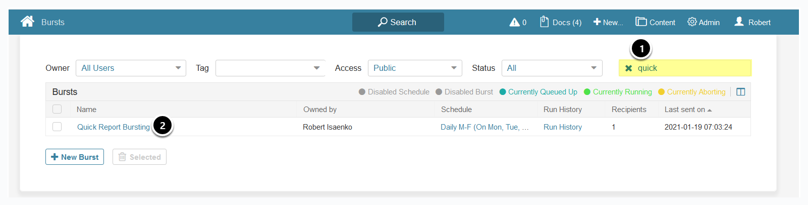
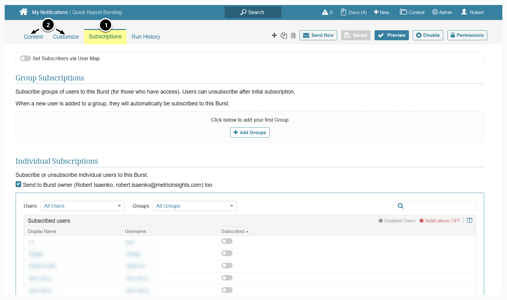
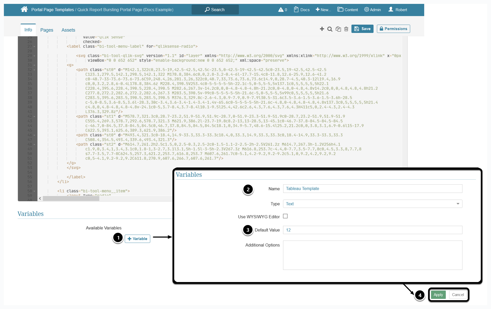
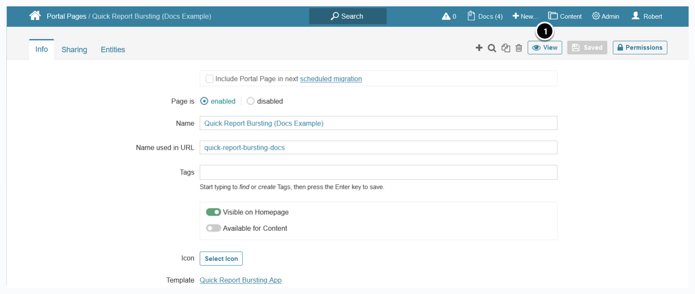

# Quick Report Bursting Portal Page
## Introduction
A Burst is a collection of content sent to users on a schedule. Quick Report Bursting allows you to create Bursts in just a few clicks, directly including BI tool Objects (reports, dashboards, metrics) into Bursts. You do not need to create an External Report for each new element – it is done automatically using External Report Templates, making the process more rapid and convenient. 

## Usage

### 1. Create a Burst

:warning:**Note**: To be able to select a Plugin Connection Profile and browse objects, **On-Demand Element Creation** must be enabled for that Plugin Connection Profile.
1. Select an External Report type
2. If several Plugin Connection Profiles are available:
  * **Connection**: choose Plugin Connection Profile
3. **Sheet**: select an External Report
4. **Burst**: 
  * **Add to existing**: choose a previously created Burst from 
  * **Create new**: 
    * **Schedule**: choose a schedule on which the Burst will be sent
    *  **Email Subject**: enter a subject
5. **[Schedule]**

A message notifying that the External Report was added to the Burst is displayed. 

### 2. Check the Created Burst: Access Content > Bursts

1. Filter the results by entering your Burst’s name
2. Select the created Burst

### 3. Configure the Burst

1. Manage Subscriptions for the created Burst from the _Subscriptions_ tab
2. Contine configuring your Burst by adding more Tiles, changing the Schedule, selecting communication channels, customizing the email from the _Content_ and _Customize_ tabs. 

For more details, see the [Busting](https://help.metricinsights.com/m/Pushing_Information_to_Users/c/110198) chapter.

## Installation
### 1. Access Admin > Portal Pages > Templates

1. Below the grid, click **[+ New Template]**
2. **Internal Name**: “quick-report-bursting”
3. **[Save]**

### 2. Upload Assets
There are several ways of uploading assets:
* manually via a ZIP archive 
* syncing with a Git repository

### 2.1. [Upload Assets via ZIP archive](https://help.metricinsights.com/m/Managing_the_Metric_Insights_Environment/l/1361186-upload-portal-page-template-assets-via-zip-archive)
  
### 2.2. [Sync with Git](https://help.metricinsights.com/m/Managing_the_Metric_Insights_Environment/l/1359676-sync-portal-page-templates-with-github)

### 3. Add Variables

On the _Info_ tab, add the next Variables, (paths are provided for convenience):

* _Tableau Template_, _Microsoft Power BI Template_, _Qlik Sense Template_
  * These are External Report Templates, can be found under **Admin > Reference Objects > Object Templates > External Report tab**
* Digest Template: 
  * Admin > Distribution > Email Templates
* Default Notification Schedule: 
  * Admin > Distribution > Notification Schedules

 Repeat the next steps for the Variables listed above: 
1. At _Variables_ section, select **[+ Variable]**
2. Enter the **Name** and **Default Value** of the Variable. 
     * **Name**: Names of the Variables are listed above
     * **Default Value** is the ID of the Element (can be found in the URL of the element)
3. **[Apply]**

### 4. Add Portal Page:  Admin > Portal Pages

1. Below the grid, select **[+ New Page]**
2. **Template**: select the Portal Page Template created at Step 1
3. **[Save]**

### 5. Configure Variables

Optionally, you can change the values of Variables. 
 
Once you have made all the changes, click **[Save]**.

### 6. View the Portal Page

1. To display the Portal Page, select **[View]** in the **_Portal Page Editor_**. 
 
The Quick Report Bursting Portal Page is displayed. 

